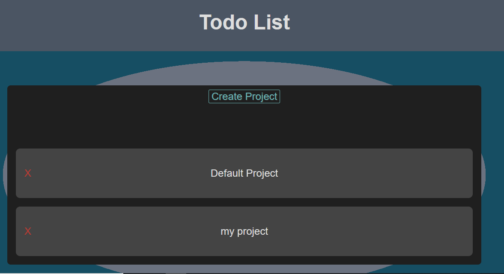
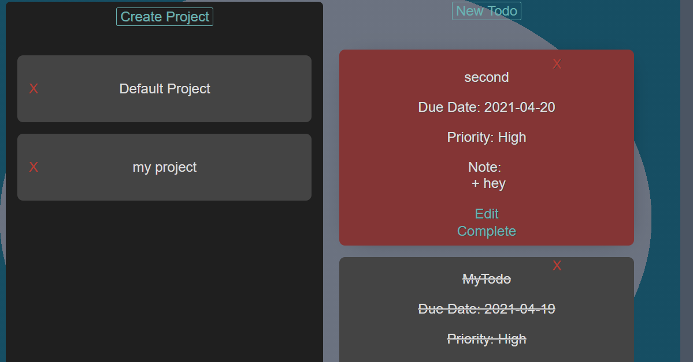

# todo-list

## About the app

This is a Microverse project, and this time I was required to create a todo list to put into practice the ES6 and functional programming.
In this project users can create a project, inside a project, you can create a todo, you can select priority as high, medium , or low.





## Getting Started

## Setup

To get started, you should first get this file in your local machine by cloning or forking this project or typing in your terminal

> git clone https://github.com/elisha2kyakpo1/todo-list

> cd todo-list

> npm install webpack webpack-cli --save-dev

> npn install

Just run the command below for webpack to compile the code.

> npx webpack --watch

## Contributing

Contributions, issues and feature requests are welcome! Start by:

Forking the project

Cloning the project to your local machine

cd into the project directory

> cd todo-list

> Run git checkout -b your-branch-name

Make your contributions

Push your branch up to your forked repository

Open a Pull Request with a detailed description to the development branch of the original project for a review

---

Built With

This project was built using these technologies.

```
Javascript

Webpack

HTML/CSS

Bootstrap

ESlint

VSCode editor

Git

Github
```
## Unit Testing

For unit testing please clone the repo and run the tests with two simple steps:

```
git clone https://github.com/elisha2kyakpo1/todoList.git

git checkout test-todolist

run 'npm run test' on terminal
```

## Contributors

## Elisha Kyakopo

  Linkedin: [Elisha Kyakopo](https://www.linkedin.com/in/elisha-kyakopo/)

  Github: [@elisha2kyakpo1](https://github.com/elisha2kyakpo1)

  Twitter: [@elisha1k](https://twitter.com/Elisha1k)

## Contributions

Contributions, issues and requests are welcome

## Show support

Give a star if you like the project
